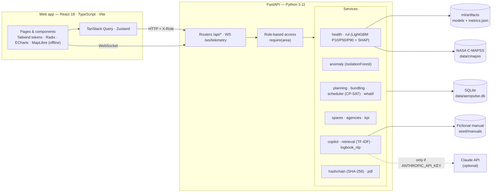

# AeroPulse

**Air Power – Predictive Maintenance & Fleet Availability** · Smart India Hackathon 2026 · problem **SIH26249** (Ministry of Defence)

> AeroPulse turns air-fleet maintenance from reactive to predictive — it unifies scattered data, predicts failures
> with reasons and confidence, and plans maintenance around missions so the maximum number of aircraft are ready to fly.

All fleet data is **simulated** (fictional tail numbers `AP-101…AP-160`, generic aircraft types, fictional units, agencies and
missions). Engine degradation comes from the public **NASA C-MAPSS** turbofan dataset. See [Data: simulated vs real](#data-simulated-vs-real).

---

## Quick start

```bash
make dev
# → web app  http://localhost:5173
# → API docs http://localhost:8000/docs
```

Requirements: **Python 3.11**, **Node 20+**, `make` (`uv` is used if installed, otherwise `venv` + `pip`).

The first `make dev` creates both environments, trains the RUL models (~6 minutes, one-off) and generates the fleet
database (~10 s). After that everything runs **fully offline**: fonts are bundled, the India map is a local GeoJSON file,
models and data are local, and the Copilot works without any API key.

| Command | What it does |
|---|---|
| `make dev` | Set up (first run), then serve API on :8000 and web app on :5173 |
| `make seed` | Regenerate the deterministic simulated fleet (`data/aeropulse.db`) |
| `make train` | Train RUL quantile models + anomaly detectors on C-MAPSS, write `metrics.json` |
| `make test` | Ruff + 43 pytest tests, then `tsc`, ESLint and Vitest |
| `make smoke` | Playwright: every page renders with no console errors and no horizontal overflow |
| `make screenshots` | Playwright screenshots of every page and key state at 1440×900 and 390×844, dark + light |
| `node frontend/scripts/demo-run.mjs` | Runs the 8-step Guided Demo end-to-end and screenshots each step |

Optional: `export ANTHROPIC_API_KEY=…` lets the Copilot write answers with Claude (model `claude-opus-5-5`, override with
`AEROPULSE_LLM_MODEL`) from the same locally retrieved sources. Without a key — or if the network is unavailable — the
Copilot returns a structured retrieval-only answer with the same citations.

---

## What it does — requirement → feature

| Official pain point / ask | AeroPulse answer | Where |
|---|---|---|
| Health monitoring, technical records, spares and agencies not integrated | **Data Hub**: one model per aircraft → component → serial joining all four sources, quality scores, lineage, CSV ingestion | Data Hub |
| Delayed fault prediction | **Predictive Health**: engine RUL with P10/P50/P90 and SHAP reasons in plain English; condition model for other systems | Predictive Health, Aircraft |
| Avoidable downtime | **Readiness-first scheduler** (OR-Tools CP-SAT) + **opportunistic bundling** | Planner |
| Sub-optimal utilisation | **Mission-aware planning**, **What-If simulator**, **30-day readiness forecast** | Planner, What-If, Overview, Missions |
| Reactive maintenance | Alerts ranked by risk × mission impact before failure; **unknown-fault detector** (IsolationForest) | Overview, Predictive Health |
| AI/ML predictive maintenance | LightGBM quantile regression on NASA C-MAPSS, conformal intervals, model card | Predictive Health → Model card |
| IoT / health monitoring | Live telemetry stream per aircraft over WebSocket | Aircraft |
| Digital twins | Interactive SVG twin coloured by health with a −90 / +60-day time slider | Aircraft |
| Integrated maintenance analytics platform | 14 page areas, KPIs, PDF brief, documented REST + WebSocket API, role-based access | everywhere |

### Pages

- **Command Overview** — KPI tiles with weekly deltas and sparklines; offline MapLibre India map with base readiness rings
  (click to filter the whole app); 30-day readiness forecast with confidence band, mission demand and shortfall shading;
  priority alerts with one-click *Plan maintenance*; upcoming missions with coverage.
- **Fleet** — dense sortable table and grid, filters, saved views, density toggle, quick-look drawer, CSV and PDF export.
- **Aircraft / Digital twin** — original top-down schematic, component zones coloured by health, time slider, live
  telemetry (EGT, N1, N2, fuel flow, vibration, oil pressure) with normal bands, component drawer with RUL band,
  SHAP drivers, anomaly check, life-limit bars, batch traceability, maintenance history and technician feedback.
- **Predictive Health** — engine RUL ranking with interval bars, unusual-behaviour list, environment / sortie-profile
  adjustments, and the **Model card** (metrics, calibration, features, assumptions, limitations, feedback statistics).
- **Planner** — CP-SAT schedule on a custom drag-and-drop hangar timeline (constraints re-validated on drop), bundling
  savings, mission-aware toggle, and **Reactive baseline vs AeroPulse** comparison.
- **What-If** — send aircraft for maintenance, delay a part, add a mission, lose hangar bays, technician shortage;
  re-optimised side by side; save and compare up to three scenarios; spares-transfer mitigation for part delays.
- **Missions** — 60-day calendar and list with live coverage; *Can we support this mission?*
- **Spares** — RUL-driven demand, reorder alerts, inter-base transfers, cannibalisation advisor (Engineering Officer
  approval, robbed parts tracked) and counterfeit / bad-batch watch.
- **Agencies** — turnaround vs promise, on-time %, repeat-failure rate, backlog, trends and routing recommendation.
- **Technician Copilot** (mobile-first) — troubleshooting assistant with citations, logbook intelligence, voice log entry
  (Web Speech API, English / Hindi, typed fallback) and QR part lookup with a printable sheet.
- **Records & Audit** — SHA-256 hash chain over records, plan changes and approvals; *Verify integrity*; tamper demo.
- **Data Hub**, **Reports** (KPIs, commander readiness brief PDF, CSV exports) and **Settings** (deployment, security,
  preferences, Phase-2 roadmap: federated learning, hangar edge gateway, AR guidance — all marked *Planned*).

### Roles (demo login — switch from the top bar)

| Role | Sees |
|---|---|
| Commander | Overview, Fleet, Missions, Predictive Health, Planner (read), What-If, Reports |
| Engineering Officer | Everything, including approvals and plan edits |
| Technician | Fleet / Aircraft, Predictive Health, Copilot (incl. log entry and QR) |
| Logistics Officer | Fleet, Spares, Agencies, Data Hub |
| Auditor | Records & Audit, Data Hub |

Access is enforced **on the API** (`X-Role` header → `require(area)` dependency), not only hidden in the UI.

---

## Architecture



### How the main pieces work

- **RUL model** (`backend/app/ml/train_rul.py`): drop near-constant sensors; per-operating-condition normalisation
  (k-means on settings, FD002/FD004); rolling mean / volatility over 5/10/20 cycles and slopes over 10/20 cycles; RUL
  capped at 125 (piecewise linear); 5-fold **GroupKFold by engine**; LightGBM quantile regressors for P10, P50, P90;
  intervals **conformalised** on the grouped CV residuals. SHAP values per prediction are summed per sensor and turned
  into sentences ("HPC outlet static pressure rising 2.5× faster than fleet average"). 1 engine cycle ≈ 1 sortie.
- **Unknown faults** (`services/anomaly.py`): expected sensor level as a function of remaining life is learned from
  training engines; an IsolationForest on residuals and volatility flags behaviour that does not match known degradation.
- **Other components** (`services/health.py`): condition-based wear with documented environment (desert, coastal,
  high-altitude, humid, semi-arid) and sortie-profile multipliers, bounded by hours / cycles / calendar life limits.
- **Scheduler** (`services/scheduler.py`): bundles tasks per aircraft (window configurable, default 20 days), then CP-SAT
  chooses visit start days subject to hangar bays, technician hours per trade, spare-part availability (local stock,
  inter-base transfer or order), and P10 deadlines. Objective: maximise the minimum daily mission-capable count and total
  availability; mission-aware mode also minimises priority-weighted mission shortfall and keeps eligible aircraft out of
  the hangar on surge days. Solves in < 1 s on the seeded fleet.
- **Reactive baseline** (`services/planning.py`): fly until the P50 failure point, wait for local stock or an order,
  first-come-first-served bays, longer unplanned repairs, life-limit items done separately.
- **Hash chain** (`services/hashchain.py`): each entry hashes the canonical JSON of the record plus the previous hash;
  verification recomputes every link and compares each signed technical record with its current database row.

---

## Results on the seeded fleet

| | Reactive baseline | AeroPulse plan |
|---|---|---|
| Average readiness, next 30 days | 78.7 % | **91.7 %** |
| Aircraft-days on the ground | 383 | **150** |
| In-service failures | 14 | **0** |
| Missions short of aircraft | 4 of 17 | **0** |
| Exercise Garuda Shield (30 fighters, day 12) | 5 short | **covered** |

AP-112 (Engine 2: P50 18 sorties, P10–P90 15–25) is booked on days 4–7 with its hydraulic seal (bad batch HS-2291) and
landing-gear inspection bundled into the same visit — 2 groundings and 120 aircraft-hours saved.

### Model metrics (official NASA C-MAPSS test sets, true RUL capped at 125)

| Dataset | Test RMSE | MAE | NASA score | P10–P90 coverage | Grouped-CV RMSE |
|---|---|---|---|---|---|
| FD001 | **14.77** | 10.46 | 413 | 84 % | 14.18 |
| FD002 | 14.32 | 9.94 | 1,044 | 79 % | 15.44 |
| FD003 | 14.15 | 9.65 | 442 | 75 % | 12.23 |
| FD004 | 15.83 | 10.50 | 1,434 | 71 % | 14.88 |

Honest notes: FD001 meets the 13–18 RMSE target. Interval coverage reaches the 80 % target on FD001 but falls short on
FD003/FD004 (two fault modes / six operating conditions) even after conformal widening. Fleet engines use FD001 and FD003
test engines, so their true failure points are never seen by the model. Numbers are regenerated by `make train` and
shown live on the Model card.

---

## Guided demo (≈ 5 minutes)

Click **Guided demo** in the top bar (or ⌘K → *Start guided demo*). Every number is read from the API at that moment.

1. **Overview** — readiness 73 %, Exercise Garuda Shield starts in 12 days and needs 30 fighters; the reactive forecast
   shows a shortfall (red band).
2. **Top alert → AP-112** — digital twin; Engine 2 fails in 18 sorties (15–25) with SHAP reasons; two more tasks due.
3. **Logbook intelligence** — hydraulic seal batch HS-2291 failed on 6 aircraft at 3 bases (median 148 h vs 1,358 h).
4. **Planner → Optimise (mission-aware + bundling)** — AP-112 in the hangar on days 4–7, before the exercise, 3 tasks
   bundled; the fighter shortfall disappears.
5. **Reactive vs AeroPulse** — +13 points average readiness, 233 aircraft-days of downtime avoided.
6. **What-If: seal delivery delayed 10 days** — without action AP-125 is serviced after its P10 point; AeroPulse
   transfers a seal kit from Jodhpur instead.
7. **Copilot on a phone-width view** — technician symptom → ranked causes, checks and similar past cases; voice log entry.
8. **Records** — a signed record is edited directly in the database; *Verify integrity* pinpoints it. Finishing restores it.

Re-running the demo resets the plan and the tamper demo first, so it is repeatable.

---

## Data: simulated vs real

| Data | Source |
|---|---|
| Engine sensor histories, degradation, RUL truth | **Real**: NASA C-MAPSS (Saxena et al., 2008), FD001/FD003 bundled in `data/cmapss/`, FD002/FD004 downloaded by `make train`. If unavailable offline, a same-schema **synthetic** set is generated and labelled "synthetic" in the UI. |
| Bases | Real Indian city names and coordinates; environments are generic. |
| Aircraft, squadrons, components, serials, batches, suppliers | **Simulated** (fictional). |
| 3,232 technical records (English + Hinglish), work orders | **Simulated**, deterministic seed, with planted patterns: bad seal batch HS-2291, cold-start APU faults at Leh, corrosion at Jamnagar. The analytics discover them from generic statistics. |
| Spares, agencies, job history, missions, technicians | **Simulated** (fictional names). |
| Maintenance manual | **Fictional** demonstration extract — never for real maintenance. |
| Live telemetry | Replays each engine's recent C-MAPSS history; vibration and oil pressure are derived signals for demonstration. |
| India map | DataMeet state boundaries (CC BY 4.0, Survey of India depiction), simplified for offline use. |

No real military unit identifiers or Air Force data are used.

---

## Project layout

```
backend/   FastAPI app (api/, services/, models/, ml/, seed/), pytest suite
frontend/  React app (app/, components/, features/<page>/, lib/, styles/), Playwright scripts
data/      SQLite database (generated) and NASA C-MAPSS files
scripts/   dev.sh (runs both servers), screenshots.sh
CLAUDE.md  conventions for future development sessions
```

## API

Every view is backed by the documented API at **`/docs`** (OpenAPI). Highlights: `GET /api/kpi/overview`,
`GET /api/bases`, `GET /api/aircraft`, `GET /api/aircraft/{tail}`, `GET /api/aircraft/{tail}/twin?day_offset=`,
`WS /ws/telemetry/{tail}`, `GET /api/health/engines`, `GET /api/health/model-card`, `POST /api/health/feedback`,
`GET /api/anomalies`, `POST /api/schedule/optimise`, `GET /api/schedule`, `PATCH /api/schedule/{id}`,
`GET /api/schedule/compare`, `POST /api/whatif/run`, `GET|POST /api/whatif/scenarios`, `GET /api/missions`,
`GET /api/missions/{id}/coverage`, `GET /api/spares`, `GET /api/spares/transfers`, `GET /api/spares/cannibalisation`,
`GET /api/spares/batch-watch`, `GET /api/agencies/scorecard`, `POST /api/copilot/ask`, `GET /api/logbook/insights`,
`POST /api/logbook/entry`, `GET /api/records/verify`, `GET /api/audit`, `GET /api/datahub/sources`,
`POST /api/datahub/upload`, `GET /api/reports/brief.pdf`.

## Limitations

- C-MAPSS is a simulated turbofan; a real deployment would retrain on the fleet's own health-monitoring data.
- Non-engine components use a parametric wear model rather than learned models (no public data for them).
- The scheduler plans at day granularity over 30 days and treats inter-base transfers as a fixed two-day lead time.
- Voice entry depends on the browser's Web Speech API (Chrome / Edge); the typed path always works.
